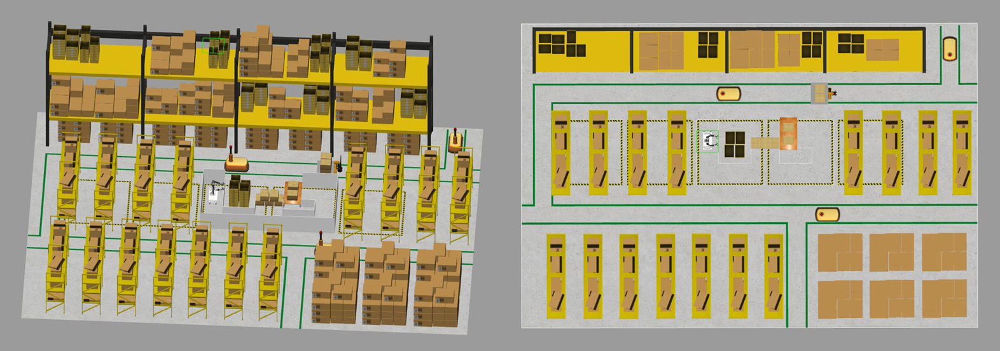
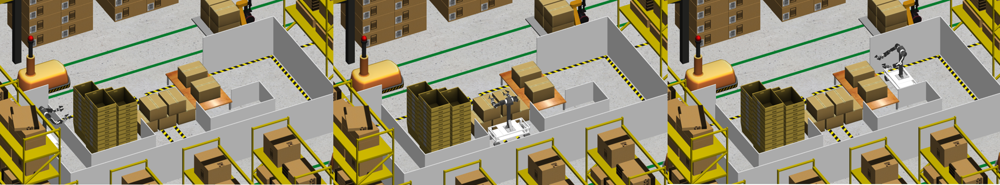
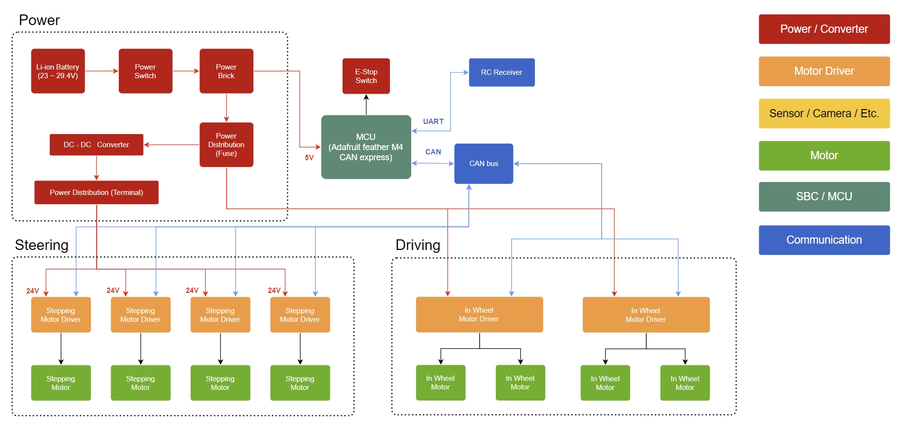

# Heading-Aware-CBF-MPPI
Paper : CBF-Critic-Based Heading-Aware MPPI Navigation for Omnidirectional Mobile Robots

## MPPI Parameters
| Category         | Parameter                      | Symbol                      | Sim. Value | Real Value | Unit  |
| ---------------- | ------------------------------ | --------------------------- | ---------- | ---------- | ----- |
| MPPI Core        | Number of samples (Batch size) | $K$                         | 300        | 800        | -     |
| MPPI Core        | Prediction horizon             | $N$                         | 40         | 30         | steps |
| MPPI Core        | Time step interval             | $\Delta t$                  | 0.05       | 0.05       | s     |
| Sampling Noise   | Linear velocity noise std.     | $\sigma_x,\ \sigma_y$       | 0.2        | 0.4        | m/s   |
| Sampling Noise   | Angular velocity noise std.    | $\sigma_\theta$             | 0.1        | 0.7        | rad/s |
| Kinematic Limits | Max linear velocity            | $v_{x,\max},\ v_{y,\max}$   | 0.5        | 0.3        | m/s   |
| Kinematic Limits | Max angular velocity           | $\omega_{\max}$             | 0.3        | 0.3        | rad/s |
| Critic Weights   | Goal distance cost weight      | $w_{\mathrm{goal}}$         | 5          | 5          | -     |
| Critic Weights   | Goal angle cost weight         | $w_{\mathrm{goal\ angle}}$  | 3          | 3          | -     |
| Critic Weights   | Path follow cost weight        | $w_{\mathrm{path}}$         | 5          | 5          | -     |
| Critic Weights   | Constraint (Kinematics) cost   | $w_{\mathrm{const}}$        | 4          | 5          | -     |
| Critic Weights   | CBF safety cost weight         | $w_{\mathrm{cbf}}$          | 5          | 5          | -     |
| Critic Weights   | Adaptive heading (Path angle)  | $w_{\mathrm{path\ angle}}$  | 2          | 15         | -     |
| Critic Weights   | Adaptive heading (Lock)        | $w_{\mathrm{lock}}$         | 5          | 8          | -     |
| Critic Weights   | Fixed region lock weight       | $w_{\mathrm{region\ lock}}$ | 10         | 8          | -     |
| CBF Settings     | CBF decay rate parameter       | $\alpha$                    | 0.7        | 0.4        | -     |

## Simulation Environment
### Robot URDF

### Case Study 1

### Case Study 2

## Hardware Description
### On board PC
- ASUS NUC 15 Pro
- Intel Core Ultra 5 225H
- 16GB RAM

### Low Level

### Real Robot Platform
- Step Motor
- In-wheel Motor

~ing