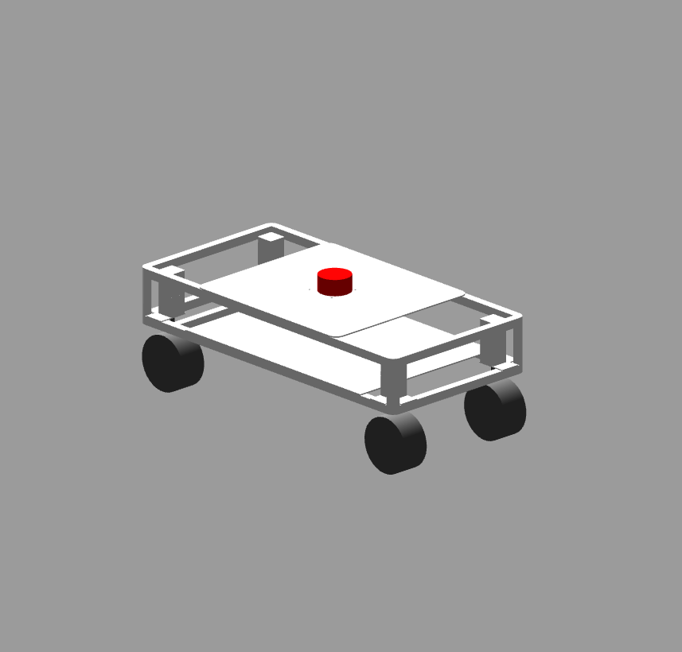
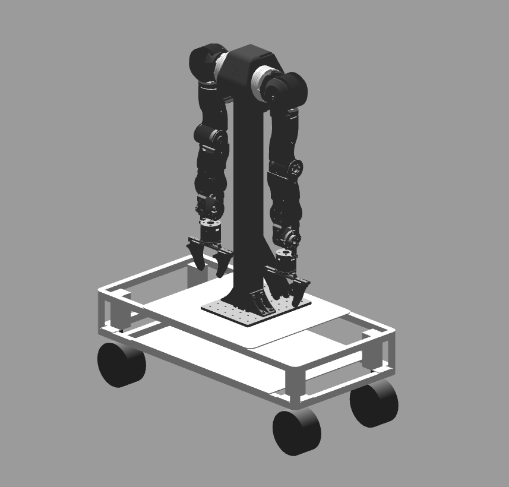
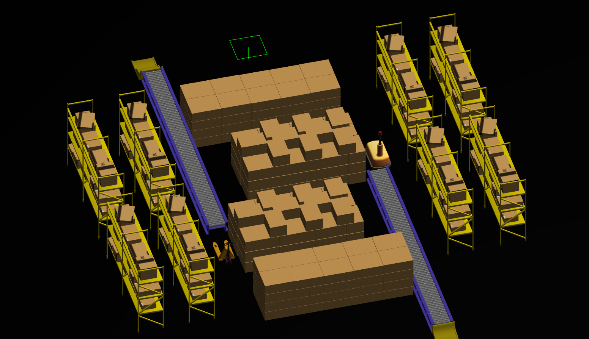
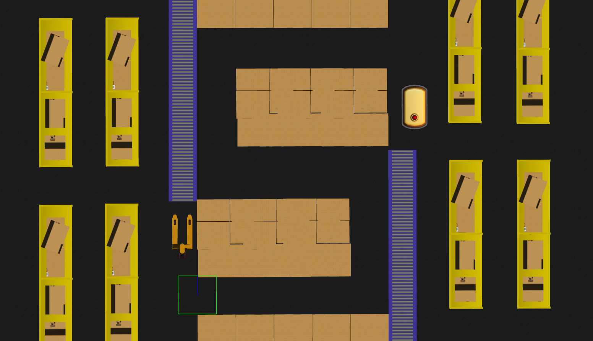
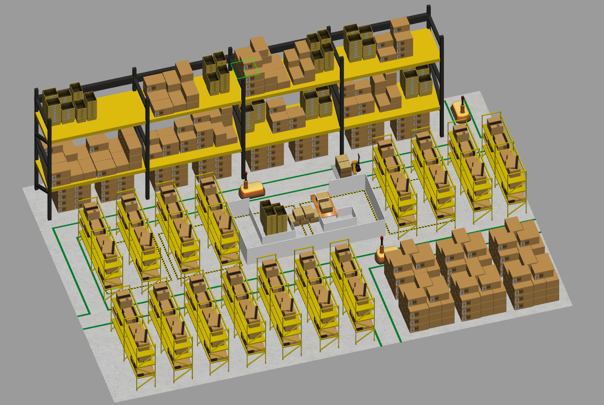
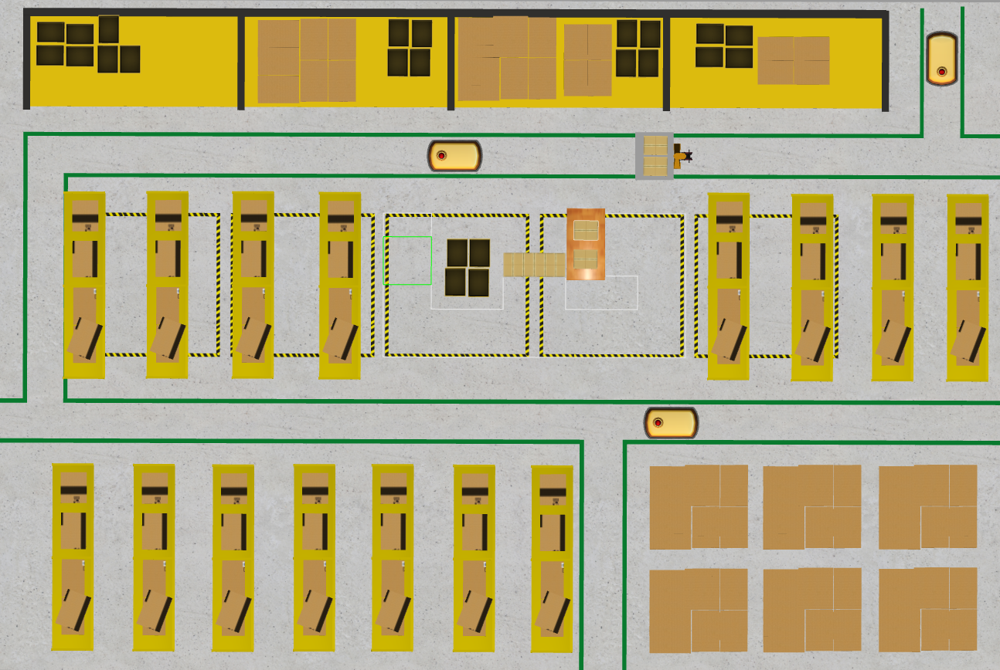

<div align="center">

# Heading-Aware-CBF-MPPI
**CBF-Critic-Based Heading-Aware MPPI Navigation for Omnidirectional Mobile Robots**


<br>

[](https://github.com/yourname/yourrepo)


</div>

<p align="center">
  
</p>

## 📦 Package Overview

| Package | Description |
| :------- | :----------- |
| [`swerve_bringup`](./swerve_bringup) | Integrated launch package for running complete case-based simulation setups. |
| [`swerve_cartographer`](./swerve_cartographer) | Cartographer-based SLAM and map management package. |
| [`swerve_controller`](./swerve_controller) | Swerve-drive kinematics, wheel control, and odometry package. |
| [`swerve_description`](./swerve_description) | Robot URDF/Xacro, meshes, sensors, and visualization package. |
| [`swerve_gazebo`](./swerve_gazebo) | Gazebo worlds, simulation robot models, sensors, and controller configurations. |
| [`swerve_mppi_controller`](./swerve_mppi_controller) | Custom Nav2 MPPI controller with additional critics. |
| [`swerve_navigation`](./swerve_navigation) | Nav2 launch, parameters, RViz setup, and waypoint goal sender package. |
| [`swerve_teleop`](./swerve_teleop) | Keyboard teleoperation package for manual robot control. |


<p align="center">
  
</p>

## 🚀 Quick Start
### Prerequisited
- [](https://releases.ubuntu.com/22.04/)
- [](https://docs.ros.org/en/humble/Installation/Ubuntu-Install-Debs.html)
- [](https://classic.gazebosim.org/)

### Dependencies
Nav2:

```bash
sudo apt install ros-humble-navigation2 ros-humble-nav2-bringup
```

Cartographer:
```bash
sudo apt install ros-humble-cartographer ros-humble-cartographer-ros
```

Gazebo:
```bash
sudo apt install ros-humble-gazebo-ros-pkgs
```

### Installation

1. Create a ROS2 workspace and clone this repository:

```bash
mkdir -p ~/swerve_ws/src && cd ~/swerve_ws/src
git clone https://github.com/SOON00/Heading-Aware-CBF-MPPI.git .
```

2. Install dependencies:
```bash
cd ~/swerve_ws
sudo apt update
rosdep update
rosdep install --from-paths src --ignore-src -r -y
```

3. Build the workspace:

```bash
colcon build --symlink-install
```

> ⚠️ **Warning**  
> If your computer has less than **16 GB of RAM**, it is recommended to build with only one parallel worker.  
> Otherwise, the build process may consume too much memory and your system may freeze.

```bash
colcon build --symlink-install --parallel-workers 1
```

4. Source the workspace:

```bash
source ~/swerve_ws/install/setup.bash
```

> 💡 **Tip**  
> To avoid sourcing the workspace manually every time you open a new terminal, add the command to your `~/.bashrc`:

```bash
echo "source ~/swerve_ws/install/setup.bash" >> ~/.bashrc
source ~/.bashrc
```

<p align="center">
  
</p>

## ⚙️ Simulation Environment
### Robot Model Types
| Swerve Drive | Swerve Drive with Open Arm |
|---|---|
|  |  |

### Gazebo Worlds
Case Study 1:
<table>
  <tr>
    <td width="50%" align="center">
      
    </td>
    <td width="50%" align="center">
      
    </td>
  </tr>
</table>

Case Study 2:
<table>
  <tr>
    <td width="50%" align="center">
      
    </td>
    <td width="50%" align="center">
      
    </td>
  </tr>
</table>

<p align="center">
  
</p>

## 📝 Case Study 1
### Narrow Corridor Navigation
Evaluates heading-aware path tracking in a narrow corridor with multiple sharp 90-degree turns using the proposed **Adaptive Heading Critic**.

### Run Simulation
Run the gazebo simulation:
```bash
ros2 launch swerve_gazebo gazebo.launch.py world:=case1 model:=swerve
```

Launch the navigation:
```bash
ros2 launch swerve_navigation navigation_launch.py mode:=sim map:=case1.yaml params:=case1
```

Run the waypoint following node:
```bash
ros2 run swerve_navigation waypoint_goal_sender_case1
```

Alternatively, you can run the complete Case 1 simulation setup with:
```bash
ros2 launch swerve_bringup case1_sim_bringup.launch.py
```

<p align="center">
  
</p>

## 📝 Case Study 2
### Task-Oriented Region-Locked Control
Evaluates region-specific heading control in a warehouse-inspired loading dock and parallel parking scenario using the proposed **Heading Fixed Region Critic**.
### Run Simulation
Run the gazebo simulation:
```bash
ros2 launch swerve_gazebo gazebo.launch.py world:=case2 model:=openarm
```

Launch the navigation:
```bash
ros2 launch swerve_navigation navigation_launch.py mode:=sim map:=case2.yaml params:=case2
```

To move the OpenArm to the demonstration-ready configuration, publish the predefined joint position command below:

```bash
ros2 topic pub /arm_position_controller/commands std_msgs/msg/Float64MultiArray "
data: [0.717, -0.467, -0.773, 0.898, 0.637, 0.573, 0.110, -0.717, -0.467, 0.773, -0.898, -0.637, -0.573, -0.110]
" --once
```

Run the waypoint following node:
```bash
ros2 run swerve_navigation waypoint_goal_sender_case2
```

Alternatively, you can run the complete Case 2 simulation setup with:
```bash
ros2 launch swerve_bringup case2_sim_bringup.launch.py
```

<p align="center">
  
</p>

## 🔧 Usage
### Visualize
Launch the robot description in RViz to inspect the URDF model and test joint movements interactively with `joint_state_publisher_gui`:

```bash
ros2 launch swerve_description visualize_description.launch.py model:=<swerve or openarm>
```

> 💡 **Tip**  
> The `model` argument selects which robot configuration to load: `swerve` or `openarm`.  
> If omitted, the default configuration is `swerve`.

### Gazebo Simulation
Spawn the robot in Gazebo, receive sensor data, and control it using teleoperation:

```bash
ros2 launch swerve_gazebo gazebo.launch.py world:=<world_name> model:=<swerve or openarm>
```

> 💡 **Tip**  
> Use the `world` argument to select the Gazebo world to load.  
> If no world is specified, the robot is spawned in the default `empty` world.

### Teleoperation
Control the robot manually using keyboard:

```bash
ros2 run swerve_teleop teleop_keyboard
```

### Mapping
Run Cartographer SLAM to generate a map of the environment:

```bash
ros2 launch swerve_cartographer cartographer.launch.py mode:=<sim or real>
```
> 💡 **Tip**  
> Use the `mode` argument to select the execution environment: `sim` or `real`.  
> If omitted, the default mode is `sim`.

To save the generated map, run:

```bash
cd ~/swerve_ws/src/swerve_cartographer/maps
ros2 run nav2_map_server map_saver_cli -f <map_name>
```

### 

<p align="center">
  
</p>

## Hardware Information

| Component | Specification |
| :--------- | :------------- |
| Mobile Base | 4-wheel swerve drive |
| Steering Motor | 4 × stepper motors |
| Drive Motor | 4 × in-wheel motors |
| Microcontroller | Arduino Portenta H7 |
| Onboard PC | ASUS NUC 15 Pro |
| LiDAR | 2D LiDAR |
| IMU | 9-axis IMU |
| Communication | CAN / USB |

<p align="center">
  
</p>

## MPPI Parameters
| Category         | Parameter                      | Symbol                      | Sim. Value | Real Value | Unit  |
| ---------------- | ------------------------------ | --------------------------- | ---------- | ---------- | ----- |
| MPPI Core        | Number of samples (Batch size) | $K$                         | 300        | 800        | -     |
| MPPI Core        | Prediction horizon             | $N$                         | 40         | 30         | steps |
| MPPI Core        | Time step interval             | $\Delta t$                  | 0.05       | 0.05       | s     |
| Sampling Noise   | Linear velocity noise std.     | $\sigma_x,\ \sigma_y$       | 0.2        | 0.4        | m/s   |
| Sampling Noise   | Angular velocity noise std.    | $\sigma_\theta$             | 0.1        | 0.7        | rad/s |
| Kinematic Limits | Max linear velocity            | $v_{x,\max},\ v_{y,\max}$   | 0.5        | 0.3        | m/s   |
| Kinematic Limits | Max angular velocity           | $\omega_{\max}$             | 0.3        | 0.3        | rad/s |
| Critic Weights   | Goal distance cost weight      | $w_{\mathrm{goal}}$         | 5          | 5          | -     |
| Critic Weights   | Goal angle cost weight         | $w_{\mathrm{goal\ angle}}$  | 3          | 3          | -     |
| Critic Weights   | Path follow cost weight        | $w_{\mathrm{path}}$         | 5          | 5          | -     |
| Critic Weights   | Constraint (Kinematics) cost   | $w_{\mathrm{const}}$        | 4          | 5          | -     |
| Critic Weights   | CBF safety cost weight         | $w_{\mathrm{cbf}}$          | 5          | 5          | -     |
| Critic Weights   | Adaptive heading (Path angle)  | $w_{\mathrm{path\ angle}}$  | 2          | 15         | -     |
| Critic Weights   | Adaptive heading (Lock)        | $w_{\mathrm{lock}}$         | 5          | 8          | -     |
| Critic Weights   | Fixed region lock weight       | $w_{\mathrm{region\ lock}}$ | 10         | 8          | -     |
| CBF Settings     | CBF decay rate parameter       | $\alpha$                    | 0.7        | 0.4        | -     |
